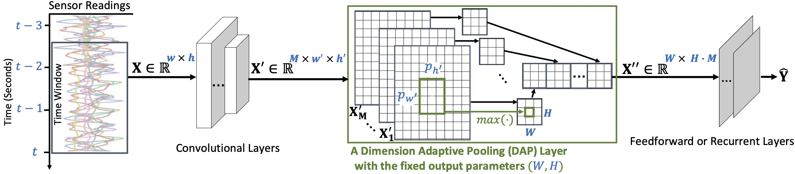
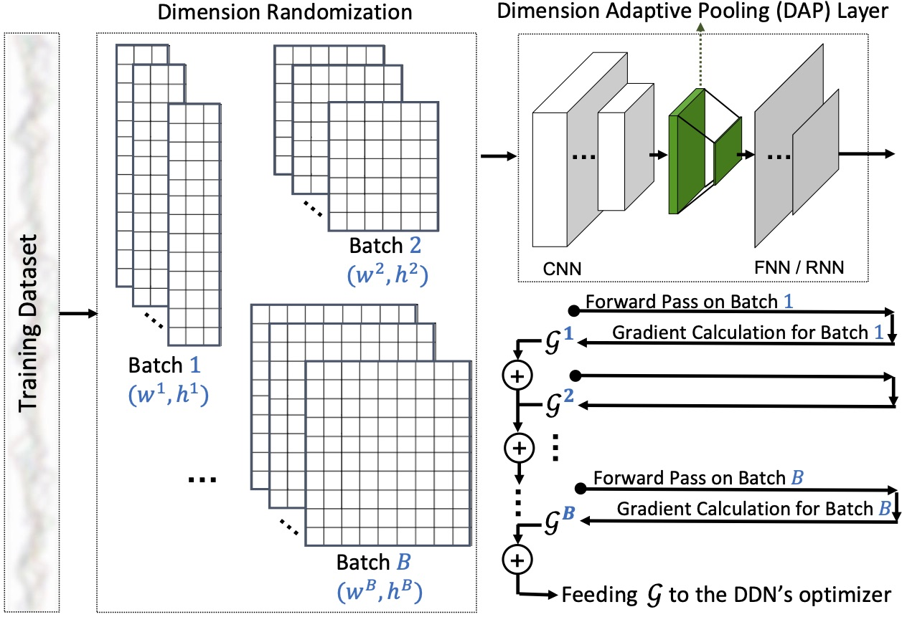
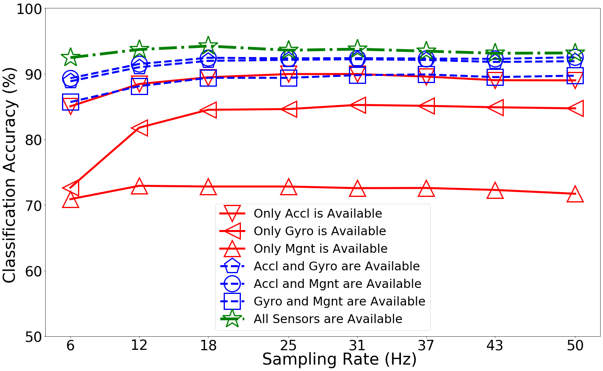

# Dimension-Adaptive Neural Architecture (DANA)[](https://colab.research.google.com/github/mmalekzadeh/dana/blob/master/experiment/DANA_a_tutorial.ipynb)

(Accepted for ACM [IMWUT](https://dl.acm.org/journal/imwut) Journal and will be presented in ACM [UbiComp 2021](https://www.ubicomp.org/ubicomp2021/) )

(The overall idea and part of the results are presented in [MobiUK2021](https://www.mobiuk.org/). Presentation video is [here](https://youtu.be/nPdrD2P5ppY?t=1377))

https://arxiv.org/pdf/2008.02397.pdf
> Motion sensors embedded in wearable and mobile devices allow for dynamic selection of sensor streams and sampling rates, enabling useful applications, e.g. for power management or control of data sharing. While deep neural networks (DNNs) achieve competitive accuracy in sensor data classification, current DNN architectures only process data coming from a fixed set of sensors with a fixed sampling rate, and changes in the dimensions of their inputs cause considerable accuracy loss, unnecessary computations, or failure in operation. To address this problem, we introduce a dimension-adaptive pooling (DAP) layer that makes DNNs flexible and more robust to changes in sampling rate and in sensor availability. DAP operates on convolutional filter maps of variable dimensions and produces an input of fixed dimensions suitable for feedforward and recurrent layers. Further, we propose a dimension-adaptive training (DAT) procedure for enabling DNNs that use DAP to better generalize over the set of feasible data dimensions at inference time. DAT comprises the random selection of dimensions during the forward passes and optimization with accumulated gradients of several backward passes. Combining DAP and DAT, we show how to transform existing non-adaptive DNNs into a Dimension-Adaptive Neural Architecture (DANA), while keeping the same number of parameters. Compared to the existing approaches, our solution provides better average classification accuracy over the range of possible data dimensions at inference time, and it does not need up-sampling or imputation, thus reduces unnecessary computations at inference time. Experimental results, on four benchmark real-world datasets of human activity recognition as well as three synthetic datasets, show that DANA prevents significant losses in classification accuracy of the state-of-the-art DNNs and, compared to baselines, it better captures correlated patterns in sensor data under dynamic sensor availability and varying sampling rates.



## Citation

https://arxiv.org/pdf/2008.02397.pdf

## To Beging With:

1. You can just click on this
[](https://colab.research.google.com/github/mmalekzadeh/dana/blob/master/experiment/DANA_a_tutorial.ipynb) to open and work with the provided tutorial using a free GPU. Or, run the tutorial on [Kaggle](https://www.kaggle.com/malekzadeh/activity-recognition-with-adaptive-neural-networks).

2. For the Controlled Experiments see this  [](https://colab.research.google.com/github/mmalekzadeh/dana/blob/master/experiment/Synthetic_Dataset_and_Experiment.ipynb)

## Another Example
```python
import os
import sys
sys.path.append("../")
from dana import models as dana_models
from dana import trainers as dana_trainers
import numpy as np
import tensorflow as tf
print("TensorFlow Version: ", tf.__version__)
```

    TensorFlow Version:  2.3.0


```python
## Download and UnZip UTwente Dataset into the Path: dana/datasets/Utwente
## https://www.utwente.nl/en/eemcs/ps/dataset-folder/ut-data-complex.rar
from dana.datasets import utwente
(X_train, Y_train, X_test, Y_test, data_class_names, data_class_weights) = utwente.load_data(shuffle=False)

rnd_seed = 0
tf.random.set_seed(rnd_seed)
np.random.RandomState(seed=rnd_seed).permutation(len(X_train))
indices = np.random.permutation(len(X_train))
X_train = X_train[indices]
Y_train = Y_train[indices] 

X_train = np.expand_dims(X_train,3)
X_test = np.expand_dims(X_test,3)
print(X_train.shape, Y_train.shape, X_test.shape, Y_test.shape)
print("Activity Weights",dict(zip(data_class_names,data_class_weights.values())))
```

    (14611, 128, 9, 1) (14611,) (3634, 128, 9, 1) (3634,)
    Activity Weights {'walk': 0.9999, 'stand': 0.9999, 'jog': 0.9999, 'sit': 0.9999, 'bike': 0.9999, 'ups': 0.9999, 'downs': 0.9999, 'type': 0.9999, 'write': 0.9999, 'coffee': 0.9999, 'talk': 0.9999, 'smoke': 0.9999, 'eat': 1.0008}


```python
def test_model(model, X_val, Y_val, batch_size, W_comb=None, H_comb=None):
    if not W_comb:
        W_comb = X_val.shape[1]
    if not H_comb:
        H_comb = list(range(X_val.shape[2]))
    val_accuracy = tf.keras.metrics.Accuracy()
    val_dataset = tf.data.Dataset.from_tensor_slices((X_val, Y_val))
    val_dataset = val_dataset.batch(batch_size)        
    for (X, Y) in val_dataset:
        X = X.numpy()                                    
        X = X[:,:,H_comb,:]                     
        X = tf.image.resize(X, (W_comb, len(H_comb)))
        logits = model(X)
        prediction = tf.argmax(logits, axis=1, output_type=tf.int32)
        val_accuracy(prediction, Y)        
    return val_accuracy.result()
```


```python
W_combinations = list(np.arange(16,129,16))
H_combinations = [[0,1,2], [3,4,5], [6,7,8], 
                  [0,1,2,3,4,5], [0,1,2,6,7,8],
                  [3,4,5,0,1,2], [3,4,5,6,7,8],
                  [6,7,8,0,1,2], [6,7,8,3,4,5],
                  [0,1,2,3,4,5,6,7,8],[0,1,2,6,7,8,3,4,5],
                  [3,4,5,0,1,2,6,7,8],[3,4,5,6,7,8,0,1,2], 
                  [6,7,8,3,4,5,0,1,2],[6,7,8,0,1,2,3,4,5]] ## Acc & Gyr & Mgn

W_combinations_validation = W_combinations
H_combinations_validation = [[0,1,2], [3,4,5], [6,7,8], 
                  [0,1,2,3,4,5], [0,1,2,6,7,8],[3,4,5,6,7,8],
                  [0,1,2,3,4,5,6,7,8]]
n_batch_per_train_setp = 5
```


```python
runs = np.arange(1,2)
for run in runs:
    ## ["standard", "reptile", "weight_avg", "dat"]
    for method in  ["dat"]:   
        history_accuracy = []
        history_time = []
        model = dana_models.Ordonez2016DeepWithDAP((None, None, 1), len(np.unique(Y_train)), (8,9))
        print(model.summary())

        loss_fn = tf.keras.losses.SparseCategoricalCrossentropy(from_logits=False)
        optimizer = tf.keras.optimizers.Adam()
        # print("**__** Run {} -- Method {}".format(run, method))
        trainer = dana_trainers.ModelTrainer(model, loss_fn, optimizer, data_class_weights,
                                              num_epochs=1000, batch_size=128, patience=100,
                                              W_combinations=W_combinations,
                                              H_combinations=H_combinations,
                                              W_combinations_validation=W_combinations_validation,
                                              H_combinations_validation=H_combinations_validation,
                                              n_batch_per_train_setp=n_batch_per_train_setp)
        save_dir_model="saved_models/exp_ut_dana/Ordonez2016DeepWithDAP_2_"+method+"_"+\
              str((len(W_combinations),len(H_combinations),n_batch_per_train_setp))+"/best_"+str(run)
       
        ##### Uncomment this if you want to train the model
        # _, best_accuracy_record, avg_training_time = trainer.train_model(X_train[len(X_train)//10:], Y_train[len(X_train)//10:],
        #                                                                  X_train[:len(X_train)//10], Y_train[:len(X_train)//10],
        #                                                                  method,
        #                                                                  save_dir=save_dir_model,
        #                                                                  verbose=10)

        # history_accuracy.append(best_accuracy_record)
        # history_time.append(avg_training_time)
        # save_dir_results = "saved_models/exp_ut_dana/Ordonez2016DeepWithDAP_2_"+method+"_"+\
        #     str((len(W_combinations),len(H_combinations),n_batch_per_train_setp))
        # if not os.path.exists(save_dir_results):
        #     os.makedirs(save_dir_results)
        # np.save(save_dir_results+"/accuracy_results_"+str(run)+".npy", history_accuracy)
        # np.save(save_dir_results+"/timing_results_"+str(run)+".npy", history_time)
        #####

        model.load_weights(save_dir_model)   
        best_accuracy_record = np.zeros((len(W_combinations_validation),len(H_combinations_validation)))
        for w in range(len(W_combinations_validation)):
            for h in range(len(H_combinations_validation)):                    
                best_accuracy_record[w,h] = test_model(model, X_test, Y_test, 128,
                                                    W_combinations_validation[w],
                                                    H_combinations_validation[h])
        
        print("\n Run {} *** Mean of Test Accuraccies: {:.3f}".format(run, np.mean(best_accuracy_record)))
        print("\n Run {} *** Test Accuraccies: {} ".format(run, (best_accuracy_record)))
```

    Model: "functional_1"
    _________________________________________________________________
    Layer (type)                 Output Shape              Param #   
    =================================================================
    input_1 (InputLayer)         [(None, None, None, 1)]   0         
    _________________________________________________________________
    conv2d (Conv2D)              (None, None, None, 64)    384       
    _________________________________________________________________
    conv2d_1 (Conv2D)            (None, None, None, 64)    20544     
    _________________________________________________________________
    conv2d_2 (Conv2D)            (None, None, None, 64)    20544     
    _________________________________________________________________
    conv2d_3 (Conv2D)            (None, None, None, 64)    20544     
    _________________________________________________________________
    DAP (DimensionAdaptivePoolin (None, 8, 576)            0         
    _________________________________________________________________
    lstm_1 (LSTM)                (None, 8, 128)            360960    
    _________________________________________________________________
    dot_1 (Dropout)              (None, 8, 128)            0         
    _________________________________________________________________
    lstm_2 (LSTM)                (None, 128)               131584    
    _________________________________________________________________
    dot_2 (Dropout)              (None, 128)               0         
    _________________________________________________________________
    act_smx (Dense)              (None, 13)                1677      
    =================================================================
    Total params: 556,237
    Trainable params: 556,237
    Non-trainable params: 0
    _________________________________________________________________
    None
    
     Run 1 *** Mean of Test Accuraccies: 0.871
    
     Run 1 *** Test Accuraccies: [[0.8503027  0.7264722  0.70886075 0.88855255 0.89323062 0.85690701
      0.92460102]
     [0.88442487 0.81783158 0.72922397 0.91001654 0.91496974 0.88112271
      0.93698406]
     [0.89460647 0.8450743  0.72812331 0.91964775 0.92432582 0.89378095
      0.94221246]
     [0.89955974 0.84617501 0.72812331 0.92129886 0.9235003  0.89378095
      0.93588334]
     [0.89955974 0.85250413 0.72564667 0.92212439 0.92377543 0.89790863
      0.93753439]
     [0.89570719 0.85112822 0.72592187 0.92102367 0.9232251  0.89900935
      0.93450743]
     [0.89020365 0.84892678 0.72289491 0.9179967  0.92267472 0.89488167
      0.93120527]
     [0.88992846 0.84727573 0.71711612 0.91909742 0.92515135 0.8970831
      0.93175566]] 


```python
import matplotlib.pyplot as plt
labels = ["Only Accl is Available", "Only Gyro is Available", "Only Mgnt is Available",
         "Accl and Gyro are Available", "Accl and Mgnt are Available", "Gyro and Mgnt are Available",
         "All Sensors are Available "]
markers = ["-vr","-<r", "-^r",
           "--pb", "--ob", "--sb", 
           "-.*g"]
fig, ax = plt.subplots(nrows=1, ncols=1, figsize=(20,12))
fig.tight_layout()
for i in range(len(H_combinations_validation)):
    y_data = best_accuracy_record[:,i]*100
    x_data = np.floor(np.array(W_combinations)/(2.56))
    if i == len(H_combinations_validation)-1:
        ax.plot(x_data, y_data, markers[i], label=labels[i], markersize= 50, linewidth=7,
            markerfacecolor="None",  markeredgewidth=3)    
    else:
        ax.plot(x_data, y_data, markers[i], label=labels[i], markersize= 40, linewidth=5,
            markerfacecolor="None",  markeredgewidth=3)    
    
ax.set_xticks(x_data)
plt.setp(ax.get_xticklabels(), fontsize=35)    
ax.set_yticks(np.arange(50,101,10))
plt.setp(ax.get_yticklabels(), fontsize=35)

fig.text(0.4, -0.05, "Sampling Rate (Hz)", size = 40)
fig.text(-0.05, 0.5, "Classification Accuracy (%)", va='center', rotation='vertical', size = 40)
ax.legend(loc= "lower center",prop={'size': 30}, ncol=1)
plt.show()
```



